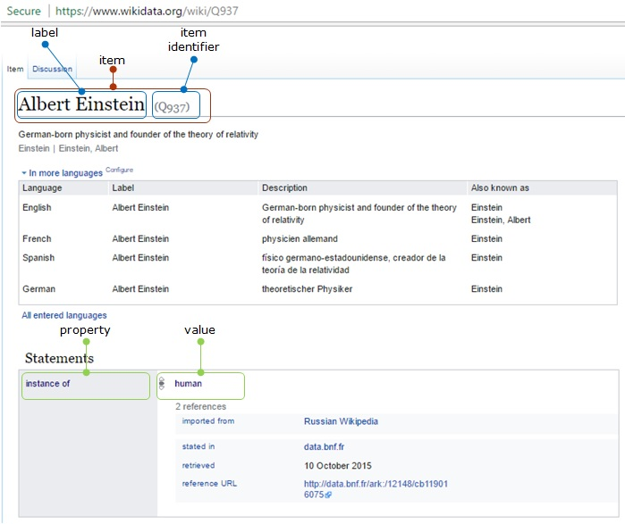

# NERD_KID  :neckbeard:

This project will focus on machine learning for classifying items found in Wikidata into 27 classes in Nerd, for instance, Institution, Location, Person.

# Goal
According to [Wikidata's statistics](https://www.wikidata.org/wiki/Special:Statistics), more than 29 million items can be found in Wikidata. With its rich and open knowledge base, it's interesting to learn how those items can be classified into 27 classes. These classes are based on [Grobid-NER](http://grobid-ner.readthedocs.io/en/latest/class-and-senses/) 's project results.

The idea of this project is to make computers understand how grouping millions of items in Wikidata into specific classes based on their data characteristics.

Let's take an example of an item [Albert Einstein](https://www.wikidata.org/wiki/Q937) in Wikidata which has an identifier 'Q937'. This item actually has a number of properties (e.g. 'instance of-P31', 'sex or gender-P21', etc.) as well as a number of values for each property (e.g. 'human-Q5' as a value of property 'P31', 'male-Q6581097' as a value of property 'P-21'). Based on a trained given model, computers will understand how making some predictions and classifying the Albert Einstein's item into a certain class, Person class, for instance. This project will also consider disambiguity of items. For instance, computers will not classify [Marshall Plan](https://www.wikidata.org/wiki/Q4576) into a Person class, because it's not a name of a person, rather it's an American initiative to aid Western Europe. 



# Tools


# Installation-Build-Run
**1. Installation**

*a. Clone this source* 

```$ git clone https://github.com/tantikristanti/NERD_KID.git```

*b. Download the zip file*

[NERD_KID](https://github.com/tantikristanti/NERD_KID/archive/master.zip)

**2. Preparing the data or models**

*Use models exist or put new models ([file].arff)* `in /data/ folder`

**3. Build the project**

```$ mvn clean install```

**4. Execute the application**

*a. Model training using Random Forest classification [SMILE](https://github.com/haifengl/smile/)*

```$ mvn exec:java -Dexec.mainClass="smile.mainSmile"```

*b. Access NERD Rest API*

(still working on it)

**5. Getting the result**

*The result of machine learning : /result/[name of file].txt* 
